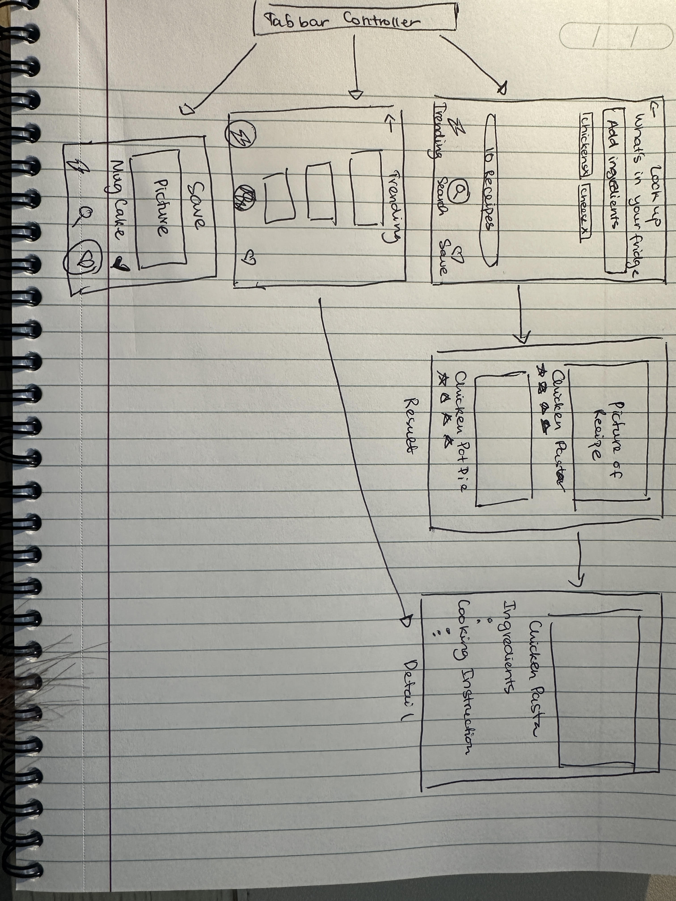

# What's in your fridge

## Table of Contents

1. [Overview](#Overview)
2. [Product Spec](#Product-Spec)
3. [Wireframes](#Wireframes)
4. [Schema](#Schema)

## Overview

### Description

This is a kitchen management and meal planning app that helps reduce food waste while making cooking more accessible. Users input or scan the items in their fridge or pantry, and the app suggests recipes that can be made with those ingredients. It’s designed for anyone looking to make meal planning simpler and reduce the number of times they have to run to the grocery store.

### App Evaluation

- **Category**: Lifestyle/Productivity
- **Mobile**: Utilizes camera for scanning, push notifications, and potentially smart device integration, offering convenience on-the-go.
- **Story**: Emphasizes sustainability, cost-efficiency, and simplification of meal prep, connecting with users on an emotional level.
- **Market**: Broad appeal to anyone who cooks, especially those interested in reducing waste and saving money.
- **Habit**: Integrates into daily cooking routines, potentially becoming a daily reference tool for meal planning.
- **Scope**: Has a clear MVP with room for growth, starting with basic inventory and recipe suggestions, scalable with additional features.

## Product Spec

### 1. User Stories (Required and Optional)

**Required Must-have Stories**

* Inventory Management: User can add items to their inventory via manual input or by taking a picture of the item or receipt.
* Recipe Suggestions: The app suggests recipes based on the ingredients currently listed in the user's inventory.
* Shopping List Generation: Based on selected recipes, the app compiles a list of missing ingredients not present in the inventory for easy shopping.

**Optional Nice-to-have Stories**

* Barcode Scanning: Enhance the inventory input process by allowing users to scan item barcodes for quick addition to the inventory.
* Expiration Tracking: Notifications alert users about items nearing their expiration date, encouraging use and reducing waste.
* Community Features: Allow users to share recipes and tips, fostering a community of users with similar interests in cooking and food management.
* User-Generated Content: Users can upload their own recipes and variations, contributing to the community-driven recipe database.
* Meal Planning Calendar: Users can plan their meals for the week/month, and the app will adjust the shopping list and recipe suggestions accordingly.
* Nutritional Information and Tracking: The app provides nutritional information for recipes and can track daily caloric intake if the user desires.

### 2. Screen Archetypes

**1. Log in/Sign Up Screen:**
The entry point where users can create a new account or log in to an existing one.

**2. Search Screen:**
After logging in, users land here to input or scan ingredients they have. This screen should have a clear call to action and a user-friendly interface to input data easily.

**3. Results/Recipes Screen:**
Based on the ingredients inputted, this screen will display a list of possible recipes the user can cook. It should be organized and provide filtering options for different types of meals, dietary restrictions, cooking time, etc.

**4. Recipe Detail Screen:**

When a user selects a recipe, they will be navigated to this detailed view which provides the recipe steps, ingredients list, and possibly user ratings or comments.

**5. Trending Recipes Screen:**

A dedicated screen showcasing recipes that are currently popular among the app's user base. This could be based on the number of saves, likes, or recent user activity.

**6.Favorite Screen:**

This is where users can view recipes they have saved to try later. This screen helps users keep track of their preferred recipes and quickly access them.

### 3. Navigation

For the "What's in Your Fridge" app, here’s how you might structure the navigation:

**Tab Navigation** (Tabs at the bottom of the app for quick switching):
1. Home/Search Tab: This is where users land after logging in. They can input or scan ingredients here to find recipes.
2. Trending Tab: Users can switch to this tab to see what recipes are popular at the moment.
3. Favorites Tab: This tab allows users to view their saved recipes for easy access later.

**Flow Navigation** (Screen to Screen):

1. **Login/Sign Up Screen**
   - => Home/Search Tab (after login/sign up)

2. **Home/Search Screen**
   - => Recipe Results Screen (upon searching)
   - => Trending Recipes Screen (via tab navigation)
   - => Favorites Screen (via tab navigation)

3. **Trending Recipes Screen**
   - => Recipe Detail Screen (when a trending recipe is selected)
   - => Home/Search Screen (via tab navigation)
   - => Favorites Screen (via tab navigation)

4. **Recipe Results Screen**
   - => Recipe Detail Screen (when a recipe is selected)

5. **Recipe Detail Screen**
   - => Home/Search Screen (to search again or go back)
   - => Add to Favorites (option within the recipe detail)

6. **Favorites Screen**
   - => Recipe Detail Screen (when a saved recipe is selected)
   - => Home/Search Screen (via tab navigation)
   - => Trending Recipes Screen (via tab navigation)

The tab navigation provides a persistent, easily accessible way to move between the core features of the app, while the flow navigation allows for a deeper dive into specific areas, like viewing recipe details or managing favorite recipes. The ability to easily navigate back to the Home/Search tab supports continuous discovery and engagement within the app.

## Wireframes

[Add picture of your hand sketched wireframes in this section]

### [BONUS] Digital Wireframes & Mockups

### [BONUS] Interactive Prototype

## Schema 

[This section will be completed in Unit 9]

### Models

[Add table of models]

### Networking

- [Add list of network requests by screen ]
- [Create basic snippets for each Parse network request]
- [OPTIONAL: List endpoints if using existing API such as Yelp]

### Worked on Features: 
[x] User can enter an ingredient or a name of recipe to look for recipes
[x] Results button shows how many recipes we got back from API
